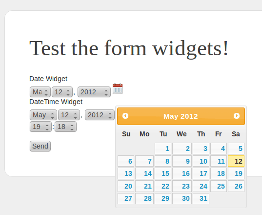

The BFOSTwigExtensionsBundle
============================

This bundle provides the following *Twig filters*:

* ``bfos_format_bytes``: Format the number in bytes into a human readable format.
* ``bfos_align_right``: Format a string: right-justification with spaces. Useful using the pre html tag.
* ``bfos_align_left``: Format a string: left-justification with spaces. Useful using the pre html tag.

and provides the following *Form types*:

* ``bfos_richtextarea``: bfos_richtextarea type to allow you use rich text form fields out of the box. Currently uses CkEditor.

Installation
------------

You need to install de submodule on the deps file::

    // deps
    [BFOSTwigExtensionsBundle]
        git=git://github.com/BrazilianFriendsOfSymfony/BFOSTwigExtensionsBundle.git
        target=/bundles/BFOS/TwigExtensionsBundle

And then::

    bash$ php bin/vendors install

Configuration
-------------

Add this to app/autoload.php::

    // app/autoload.php
    $loader->registerNamespaces(array(
      // ...
      'BFOS'              => __DIR__.'/../vendor/bundles',
      // ...
    ));

And this to app/AppKernel.php::

    // app/AppKernel.php
    $bundles = array(
      // ...
      new BFOS\TwigExtensionsBundle\BFOSTwigExtensionsBundle(),
      // ...
    );

Add the following to your config.yml

    twig:
        form:
            resources:
                - 'BFOSTwigExtensionsBundle:Form:form_div_layout.html.twig'

Usage
-----

How to use::

* FCBKComplete widget:

Setup your Type:

    public function buildForm(FormBuilder $builder, array $options)
    {
        $url = $this->container->get('router')->generate('users_autocomplete');
        $builder->add('users', 'bfos_fcbkcomplete',
            array('class'=>'FOS\UserBundle\Entity\User', 'url'=>$url, 'fcbkcomplete_options'=>array('maxitems'=>40, 'maxshownitems'=>40)));
    }

Setup your action for auto complete list:

    /**
     * Auto completer list action.
     *
     * @Route("/users/autocomplete", name="users_autocomplete")
     * @Method("get")
     */
    public function usersAutoCompleteAction(){
        if(!($q = $this->getRequest()->get('tag'))){
            return new \Symfony\Component\HttpFoundation\Response('');
        }

        $arr = array();
        $users = $this->getDoctrine()->getRepository('FOSUserBundle:User')->findForAutoComplete($q);
        foreach($users as $user){
            $arr[] = array('key'=> (string) $user->getId(), 'value'=> sprintf('%s (%s)', $user->getUsername(), $user->getEmail())) ;
        }
        return new \Symfony\Component\HttpFoundation\Response(json_encode($arr), 200, array('Content-Type'=> 'application/json'));
    }

Setup a repository method:

    public function findForAutoComplete($string, $limit = 20){
        if(!$string){
            return array();
        }

        $qb = $this->createQueryBuilder('u');
        $query = $qb->where('u.username LIKE :str')->orWhere('u.email LIKE :str')->setParameter('str', "%$string%")->getQuery();
        return $query->setMaxResults($limit)->getResult();
    }

* Date Picker widget:

Setup your Type:

    public function buildForm(FormBuilder $builder, array $options)
    {
        $builder->add('date', 'bfos_date');
    }

Warning: The widget does not support the option widget set to single_text.

* DateTime Picker widget:

Setup your Type:

    public function buildForm(FormBuilder $builder, array $options)
    {
        $builder->add('date', 'bfos_datetime');
    }

Warning: The widget does not support the option widget set to single_text.

* Filter ``bfos_format_bytes``::

    {{ [integer] | bfos_format_bytes }}

You can also specify which base is to be used (SI or Binary)::

    {# Default. SI #}
    {{ [integer] | bfos_format_bytes( true ) }}
    {# Use the binary #}
    {{ [integer] | bfos_format_bytes( false )  }}

* Filter ``bfos_align_right`` and ``bfos_align_left``

    {# Default. Use 10 columns to justify. #}
    {{ [string] | bfos_align_right }}
    {# Justify using the space of 20 columns. #}
    {{ [string] | bfos_align_right(20) }}

    {# Default. Use 10 columns to justify. #}
    {{ [string] | bfos_align_left }}
    {# Justify using the space of 20 columns. #}
    {{ [string] | bfos_align_left(20) }}

*EXAMPLE:*

The following code

    <pre>
    
    {{ "Size in bytes"|bfos_align_left(20) }}   {{ "SI"|bfos_align_right(15)}} {{ "Binary"|bfos_align_right(15)}}
    
    {{ i|bfos_align_left(20) }} = {{ i|bfos_format_bytes|bfos_align_right(15) }} {{ i|bfos_format_bytes(false)|bfos_align_right(15) }}
    
    </pre>

will produce the following result

    Size in bytes                       SI          Binary
    0                    =             0 B             0 B
    27                   =            27 B            27 B
    999                  =           999 B           999 B
    1000                 =          1000 B          1000 B
    1023                 =          1.0 kB          1023 B
    1024                 =          1.0 kB          1024 B
    1728                 =          1.7 kB         1.7 KiB
    110592               =        110.6 kB       108.0 KiB
    7077888              =          7.1 MB         6.8 MiB
    452984832            =        453.0 MB       432.0 MiB
    28991029248          =         29.0 GB        27.0 GiB
    1855425871872        =          1.9 TB         1.7 TiB
    9.2233720368548E+18  =          9.2 EB         8.0 EiB
